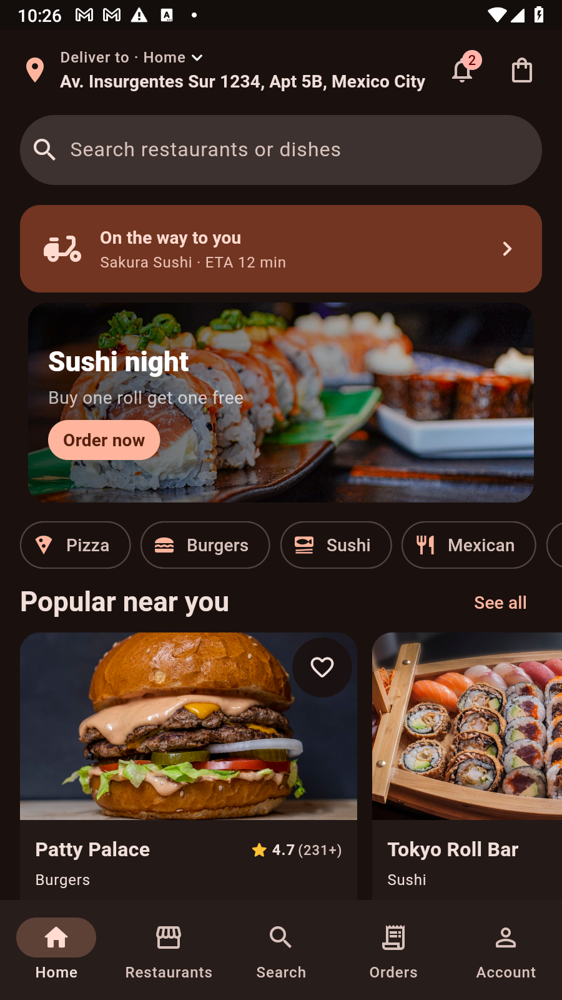
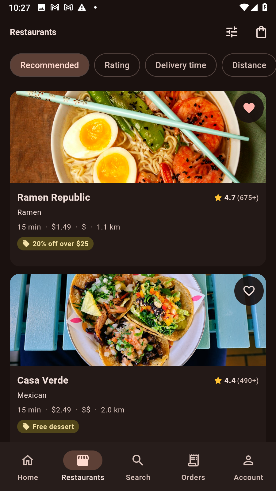
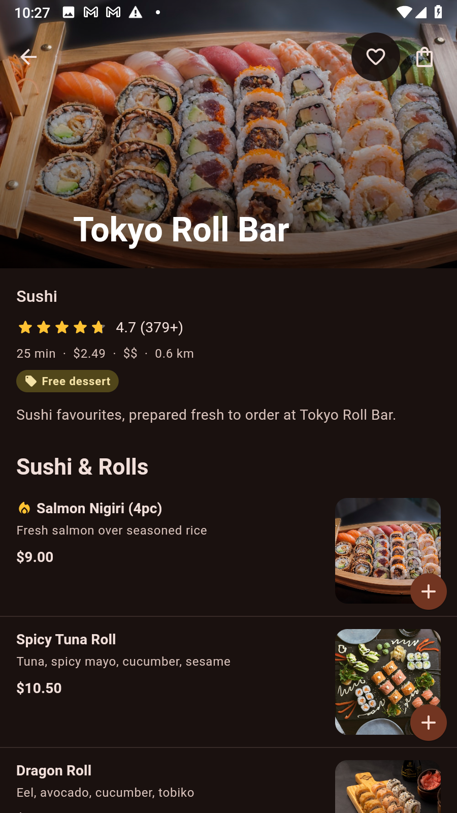
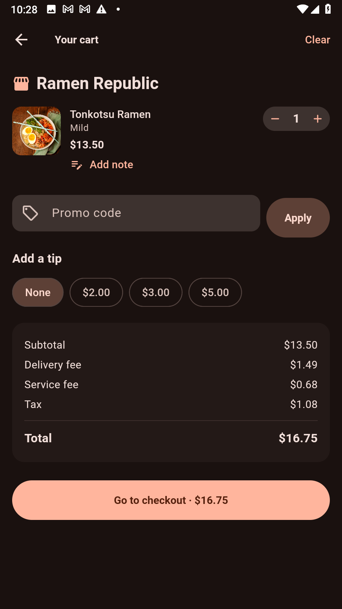
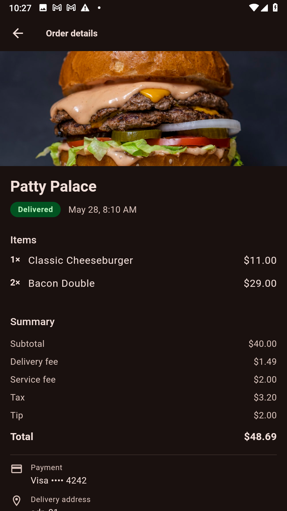

# Nomly 🍔

**Nomly** is a production-quality, cross-platform **food-delivery app** built with Flutter that
runs from a single codebase on **iOS, Android, Web, macOS, Windows and Linux**. It looks and
feels like a real delivery app: browse restaurants, customize dishes, manage a cart, check out,
and watch your courier move toward you live on a map.

It ships with a runnable **mock REST API** (json-server), a proper **networking + repository
layer** (no hardcoded data in the UI), **real food photography** everywhere, and every flow
wired **end-to-end** — including **live order tracking**.

> Brand seed color: a warm, appetizing orange `#E0531F`, which drives the entire Material 3
> `ColorScheme` (light, dark and dynamic).

---

## 📱 Screenshots

<table>
  <tr>
    <td align="center" width="20%"></td>
    <td align="center" width="20%"></td>
    <td align="center" width="20%"></td>
    <td align="center" width="20%"></td>
    <td align="center" width="20%"></td>
  </tr>
  <tr>
    <td align="center"><sub><b>Home</b><br/>address bar, search, live‑order banner, promo carousel, cuisine chips & rails</sub></td>
    <td align="center"><sub><b>Restaurants</b><br/>sort + filters, ratings, free‑delivery & offer badges</sub></td>
    <td align="center"><sub><b>Restaurant</b><br/>cover, rating, menu grouped by category, add to cart</sub></td>
    <td align="center"><sub><b>Cart</b><br/>qty, notes, promo code, tip & full fee breakdown</sub></td>
    <td align="center"><sub><b>Order detail</b><br/>status, itemized summary, payment & reorder</sub></td>
  </tr>
</table>

*(Shown in dark theme — the app also has a full light theme and platform dynamic color.)*

---

## ✨ Features

- **Material 3 / Material You** — `ColorScheme.fromSeed`, full light + dark themes, platform
  **dynamic color** (`dynamic_color`) with seed fallback. M3 components throughout:
  `NavigationBar`/`NavigationRail`, `SearchBar`, `FilledButton`, `Card`, `FilterChip`,
  `SegmentedButton`, `Badge`, M3 bottom sheets, dialogs and tonal surfaces.
- **Adaptive & responsive** — bottom `NavigationBar` (mobile), `NavigationRail` (tablet),
  extended rail (desktop/web); single‑column → multi‑column grids; the restaurant detail shows a
  **live cart side‑panel** on wide screens.
- **Complete end‑to‑end flow** — pick address → browse (search + cuisine filters + sort) →
  restaurant detail → customize a dish (size / add‑ons via bottom sheet) → cart badge updates →
  cart (qty, notes, promo, fee breakdown, tip) → **auth‑gated checkout** → place order →
  **live tracking** (status timeline + courier moving on a map + ETA) → order history → **reorder**.
- **Auth gating** — browse as a guest; checkout requires sign‑in (redirect, then resume where
  you left off).
- **Persistent everything** — favorites (restaurants + dishes), address‑book CRUD, promo codes,
  theme mode, locale, cart and recent searches all survive relaunch.
- **Real images only** — real Unsplash food photography curated into `db.json` (every URL
  verified HTTP 200) plus `randomuser.me` courier/profile portraits, loaded via
  `cached_network_image` with shimmer placeholders. No `picsum`/placeholder generators anywhere.
- **Realistic networking** — a Dio interceptor simulates **300–800 ms latency** and the
  occasional transient error, so loading (shimmer), empty and error states are genuinely
  exercised on every screen.

## 🧱 Tech stack

| Concern | Package |
|---|---|
| State management | `flutter_riverpod` + `riverpod_annotation` (codegen) |
| Routing | `go_router` (shell route, deep links, web URLs, auth redirect) |
| Networking | `dio` + `retrofit` |
| Models | `freezed` + `json_serializable` |
| Map (tracking) | `flutter_map` (OpenStreetMap — works on all six platforms, no API key) |
| Images | `cached_network_image` |
| UI helpers | `carousel_slider`, `shimmer`, `flutter_rating_bar` |
| Storage | `flutter_secure_storage` (token), `shared_preferences` (prefs/cart/favorites) |
| Formatting | `intl` |
| App icon | `flutter_launcher_icons` |

## 🏗️ Architecture

Feature‑first clean architecture. Each feature owns its `application/` (Riverpod controllers &
providers), `presentation/` (screens) and `widgets/`.

```
lib/
  core/        theme & design tokens, router (+ auth redirect), dio client + interceptors,
               env config, storage wrappers, shared providers
  data/        models (freezed), api client (retrofit), repositories
  features/    auth · address · home · restaurants · restaurant · search · cart · checkout ·
               tracking · orders · favorites · account · notifications
  shared/      reusable widgets (cards, tiles, qty stepper, state views) + adaptive layout
  app.dart · main.dart
mock-api/      json-server: db.json (real image URLs), server.js, routes.json, generators
```

Every screen reads from a repository through Riverpod providers; the UI never talks to Dio
directly, and there is no hardcoded business data in widgets.

---

## 🚀 Getting started

### Prerequisites

- Flutter (stable) — developed on **Flutter 3.44 / Dart 3.12**
- **Node.js 18+** (for the mock API)

### 1. Install & generate code

```bash
flutter pub get
dart run build_runner build --delete-conflicting-outputs   # freezed / json / retrofit / riverpod
```

> Re-run the `build_runner` step whenever you change a model, provider or API method.
> On **Windows**, enable Developer Mode (`start ms-settings:developers`) so Flutter can use
> symlinks for desktop plugin builds. (Web, `analyze` and `test` don't require it.)

### 2. Run the mock API

```bash
cd mock-api
npm install
npm run seed     # (re)generate db.json from the verified image pool (deterministic)
npm start        # serves http://localhost:3000
```

Useful scripts:

- `npm run dev` — seed then start in one go.
- `npm run verify-images` — checks that **every** image URL in `db.json` returns HTTP 200
  (exits non‑zero if any don't).

The API implements the full contract: `POST /auth/login|register`, `GET /auth/me`,
`/addresses` CRUD, `/cuisines`, `/banners`, `/restaurants` (with `cuisineId, q, minRating,
priceLevel, freeDelivery, sort, _page, _limit`), `/restaurants/:id`, `/restaurants/:id/menu`,
`/dishes/:id`, `POST /promo/validate`, `/orders` (+ `:id`, `:id/tracking`), `/favorites`,
`/notifications`. Seeded with 1 user, 3 addresses, 8 cuisines, 21 restaurants (~187 dishes), 4
banners, favorites, 5 past orders + 1 active order with courier coordinates, and 6 notifications.

Promo codes to try: **`NOMLY20`** (20% off) · **`FREESHIP`** (free delivery, min $15) ·
**`TACO10`** (10% off).

### 3. Point the app at the API

The base URL defaults sensibly per platform (`http://localhost:3000`, and `http://10.0.2.2:3000`
on the Android emulator). Override it for a physical device or a hosted API:

```bash
flutter run --dart-define=NOMLY_API_BASE_URL=http://192.168.1.50:3000
```

> Demo sign‑in accepts **any** email/password and returns the seeded user.

### 4. Run on each platform

```bash
flutter run -d chrome      # Web
flutter run -d windows     # Windows  (macos / linux on those hosts)
flutter run -d <emulator>  # Android / iOS
```

Build artifacts: `flutter build web` · `flutter build apk` · `flutter build windows` · etc.

### 5. App icon

The launcher icon (rounded‑square orange background, white takeout bag with a cut‑out fork) is
generated for all platforms via `flutter_launcher_icons` (config in `pubspec.yaml`). Master
assets live in `assets/icon/` (`icon.png` 1024², adaptive `icon_foreground.png`, and an
`icon.svg` source). To regenerate:

```bash
python tool/generate_icon.py        # (re)draw the PNGs from the mark (Pillow)
dart run flutter_launcher_icons      # emit Android/iOS/web/Windows/macOS icons
```

The SVG can also be rasterized with
`rsvg-convert -w 1024 -h 1024 assets/icon/icon.svg -o assets/icon/icon.png`.

### 6. Tests

```bash
flutter test
```

Covers the cart‑total math (add‑ons + promo + tip + free‑delivery), the filter→query‑parameter
mapping, and the restaurant repository (parsing + client‑side `offersOnly` filter) against a
mocked Dio adapter.

---

## 📝 Notes & assumptions

- **Single‑restaurant cart.** Like most delivery apps, the cart is scoped to one restaurant;
  adding a dish from another restaurant prompts to start a new cart. This keeps the placed order
  mapped cleanly to one restaurant and one delivery fee.
- **Live tracking** auto‑advances the order status on a timer and animates the courier along the
  route for the demo (the status timeline + ETA update as it moves).
- **Payment** is mocked (the card list is illustrative; no real processing), per the brief.
- Image URLs are real, openly‑hotlinkable Unsplash photos and `randomuser.me` portraits, all
  HTTP‑200‑verified at authoring time; run `npm run verify-images` to re‑check.
